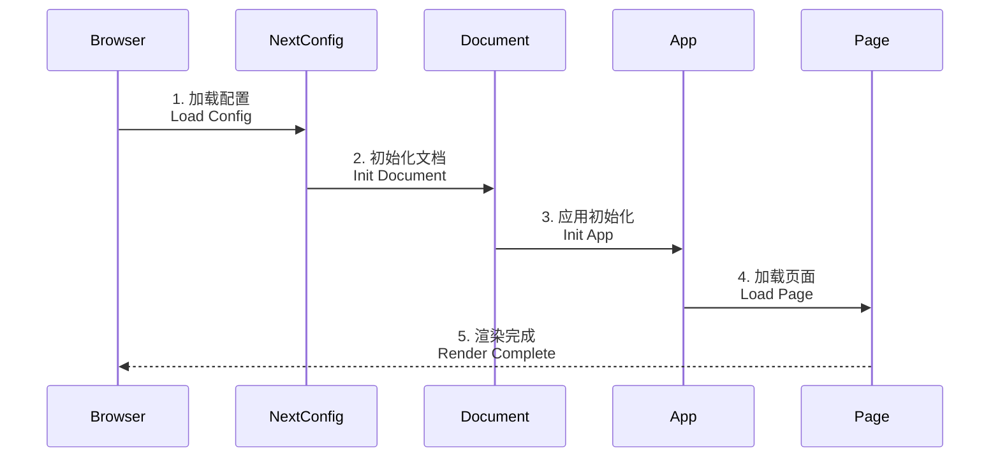

# 项目结构 / Project Structure 🏗️

## 目录结构 / Directory Structure 📁

```
2025-wiki/
├── docs/               # 文档目录 Documentation
├── public/            # 静态资源 Static assets
├── src/               # 源代码 Source code
│   ├── components/    # 组件 Components
│   ├── hooks/         # 自定义钩子 Custom hooks
│   ├── pages/         # 页面 Pages
│   ├── styles/        # 样式 Styles
│   └── utils/         # 工具函数 Utilities
├── next.config.js     # Next.js配置 Configuration
└── package.json       # 项目配置 Project config
```

## 加载流程 / Loading Process ⚡

### 页面加载流程 / Page Loading Flow

```mermaid
graph TD
    subgraph "加载流程 / Loading Flow"
        A[浏览器请求<br>Browser Request] --> B[next.config.js配置加载<br>Config Loading]
        B --> C[_document.jsx初始化<br>Document Init]
        C --> D[_app.jsx应用初始化<br>App Init]
        D --> E[全局Provider初始化<br>Provider Init]
        E --> F[页面组件加载<br>Page Loading]
        F --> G[页面hydration<br>Hydration]
        G --> H[完成渲染<br>Render Complete]
    end

    subgraph "next.config.js配置"
        B1[webpack配置] --> B2[路径别名]
        B2 --> B3[优化配置]
        B3 --> B4[环境变量]
    end

    subgraph "_document.jsx文档结构"
        C1[HTML基础结构] --> C2[Head配置]
        C2 --> C3[字体预加载]
        C3 --> C4[Main占位]
    end

    subgraph "_app.jsx应用初始化"
        E1[PageProvider] --> E2[ThemeProvider]
        E2 --> E3[InteractionProvider]
        E3 --> E4[Layout渲染]
    end
```



### 请求序列 / Request Sequence



## 核心文件对比 / Core Files Comparison 📊

<details>
<summary>💡 Click to expand comparison / 点击展开对比</summary>

| 特性 / Feature          | \_app.jsx                      | \_document.jsx                  |
| ----------------------- | ------------------------------ | ------------------------------- |
| 运行环境<br>Environment | 客户端+服务端<br>Client+Server | 仅服务端<br>Server Only         |
| 更新频率<br>Update      | 每次页面切换<br>Every Route    | 仅首次加载<br>Initial Load Only |
| CSS支持<br>CSS Support  | 支持所有CSS<br>All CSS Types   | 仅styled-jsx<br>Only styled-jsx |
| 状态管理<br>State       | ✅ 支持<br>Supported           | ❌ 不支持<br>Not Supported      |
| 事件处理<br>Events      | ✅ 支持<br>Supported           | ❌ 不支持<br>Not Supported      |

</details>

## 重要说明 / Important Notes ⚠️

<details>
<summary>📌 开发注意事项 / Development Notes</summary>

1. **页面结构 / Page Structure**

   - 使用`getLayout`模式进行布局定制
   - Use `getLayout` pattern for layout customization

2. **数据获取 / Data Fetching**

   - 优先使用静态生成
   - Prefer static generation

3. **性能优化 / Performance**
   - 实现组件懒加载
   - Implement component lazy loading
   - 优化图片资源
   - Optimize image resources

</details>

## 最佳实践 / Best Practices 💡

### 代码组织 / Code Organization

```typescript
// 组件结构示例 / Component Structure Example
export interface ComponentProps {
  // props定义 / props definition
}

export const Component: React.FC<ComponentProps> = ({ ...props }) => {
  // 组件实现 / implementation
};
```

### 性能优化 / Performance Optimization

- 使用`useMemo`和`useCallback`
- 实现代码分割
- 优化资源加载

## 扩展阅读 / Further Reading 📚

- [Next.js文档 / Documentation](https://nextjs.org/docs)
- [React最佳实践 / React Best Practices](https://reactjs.org/docs/hooks-rules.html)

